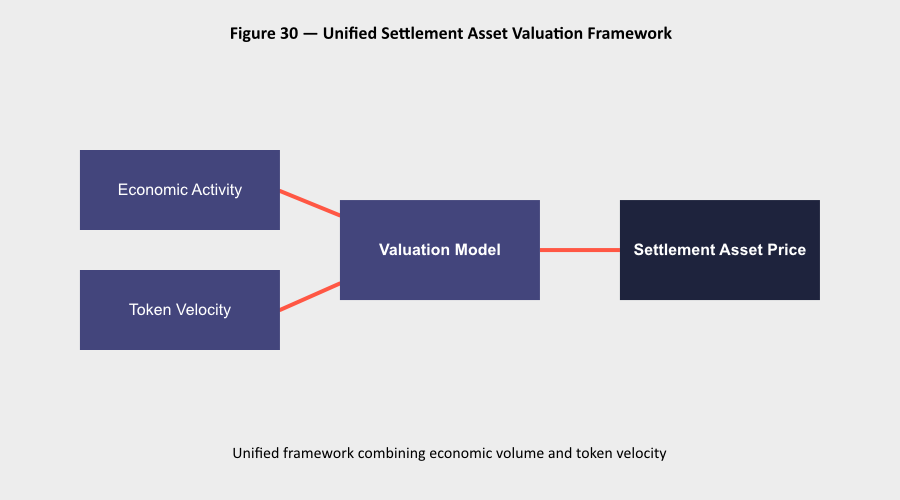
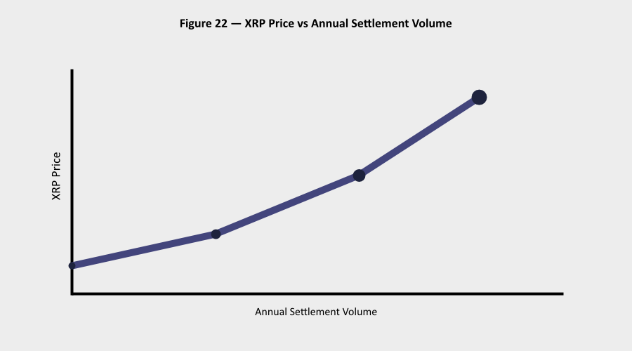

# XRP Quantitative Valuation Framework

Independent research exploring how global financial infrastructure,
tokenization, and settlement asset dynamics could influence XRP valuation.

## Key Concept

The framework links:

- Tokenized assets
- Transaction turnover
- Settlement velocity
- Circulating supply

to estimate settlement asset valuation.

## Example Relationship

This chart illustrates how XRP price scales with annual settlement volume
under different adoption scenarios.

## Documents

📄 Quantitative Valuation Framework  
https://github.com/Buzz-Light-12/xrp-quantitative-valuation-framework/blob/main/XRP_Quantitative_Valuation_Framework.pdf

📊 XRP Almanach  
https://github.com/Buzz-Light-12/xrp-quantitative-valuation-framework/blob/main/XRP_AlmanachXRP_Final2.pdf

## Author

Buzz Light (12)  
Independent Research — 2026

© 2026 Buzz Light (12)
This research is shared for educational and informational purposes.
Attribution to the author is appreciated when referencing this work.
